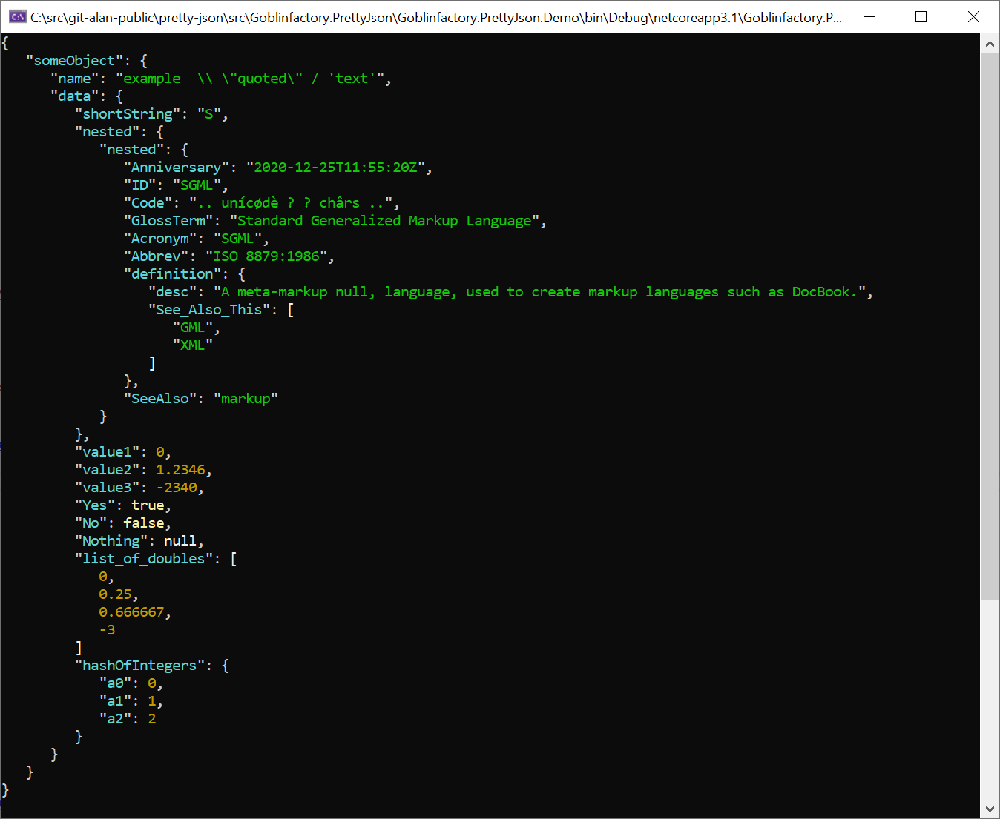
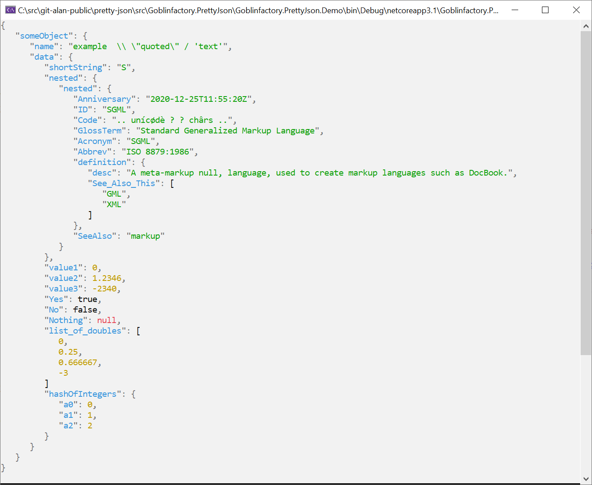
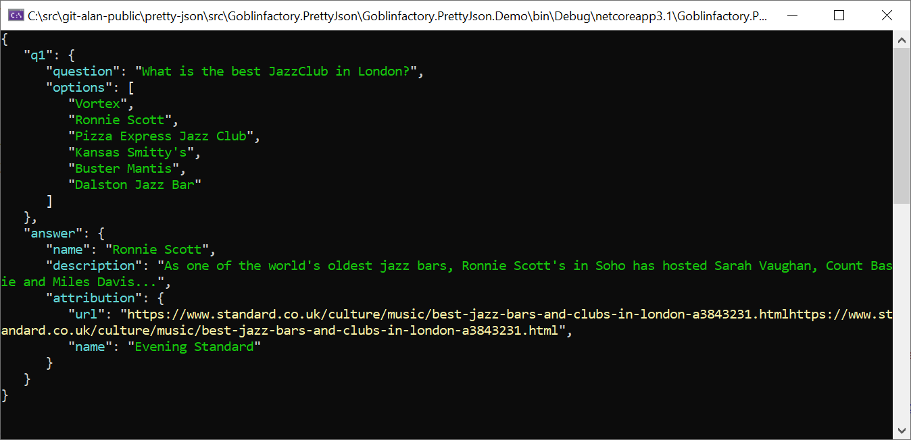
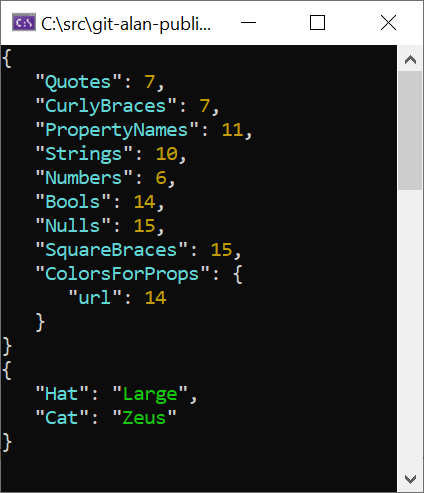
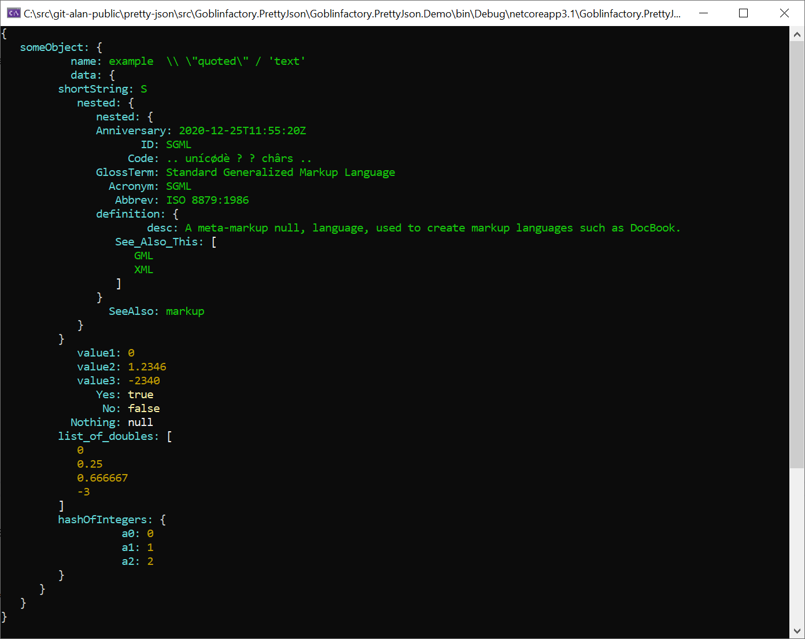
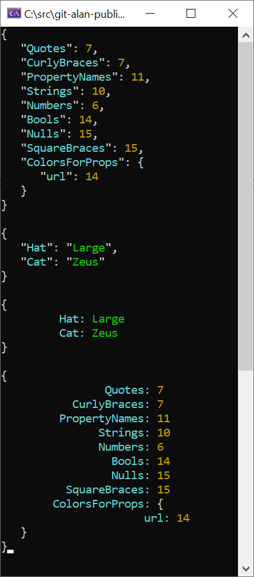

# Goblinfactory.PrettyJson

Cross platform .net core Pretty print Json files to console.

## 1 liner Usage

Install package

> dotnet add package Goblinfactory.PrettyJson

Usage

```csharp

using Goblinfactory.PrettyJson;

new PrettyPrinter(PrettyConfig.CreateDefault()).PrintJson(myData);

```

- Automatically detects dark or light backgrounds. Uses a suitable theme based on current Console background color.
- No external dependancies, uses System.Text.Json from .net core. Can be overridden to use your own serializer.
- Configurable themes for light or dark backgrounds.
- Configurable serializer.
- Can set the indenting.
- Can set the number of decimals to Round off display numbers to.
- Super light memory footprint. Based on fast forward Utf8JsonReader. Does not load whole file into memory. Can PrettyPrint gigabyte Json files!
- Configuration is `per printer`, and not global.
- Useful `.Dump()` extensions for objects and strings that will dump the object or json to console.
- Configurable styling based on property name.



## Automatically detect dark and light background

Automatically uses a suitable theme for Light or Dark backgrounds. Totally customisable.



## Easy Configuration

```csharp

using Goblinfactory.PrettyJson;
using static System.ConsoleColor;

var config = PrettyConfig.CreateDefault();

config.LightStyle.Nulls = Red;
config.DarkStyle.Nulls = Red;
config.NumberOfDecimals = 3;
config.IndentWidth = 4;

new PrettyPrinter(config).PrintJson(myData);

```

## Style a value based on it's property name

```csharp
printer.Config.DarkStyle.ColorsForProps["url"] = Yellow;
printer.Print(new
{
            q1 = new
            {
                question = "What is the best JazzClub in London?",
                options = new[] { "Vortex", "Ronnie Scott", "Pizza Express Jazz Club", "Kansas Smitty’s", "Buster Mantis", "Dalston Jazz Bar" }
            },
            answer = new
            {
                name = "Ronnie Scott",
                description = "As one of the world’s oldest jazz bars, Ronnie Scott’s in Soho has hosted Sarah Vaughan, Count Basie and Miles Davis...",
                attribution = new
                {
                    url = "https://www.standard.co.uk/culture/music/best-jazz-bars-and-clubs-in-london-a3843231.htmlhttps://www.standard.co.uk/culture/music/best-jazz-bars-and-clubs-in-london-a3843231.html",
                    name = "Evening Standard"
                }
            }
});
```

gives you ...



## Super useful `.Dump()` extentions

```
	printer.Config.DarkStyle.Dump();
	new { Hat = "Large", Cat = "Zeus"}.Dump();
```


## EasyRead mode (availabe in version 0.2 onwards)

Easyread removes all the quotes and formats the property names with a default 10 character width. (configurable)

```csharp
 printer.Config.EasyRead = true;
printer.PrintJson(data);
```




## Limitations and final thoughts



- Does not do any encoding other than replace \ with \\\\, and " with \\"
- See `StringExtensions.cs` for the string encoding.
- If you need additional encodings, please submit a PR for me to review and if it makes sense, or extend the configuration to configure diffrerent types of encoding if needed.
- This is a very small project, feel free to fork it and make your own variant. It could easily be entirely encapsulated in a single file.
- todo: provide an easyread format, which excludes commas and quotes with field padding to align property values. Similar to Yaml formatting.